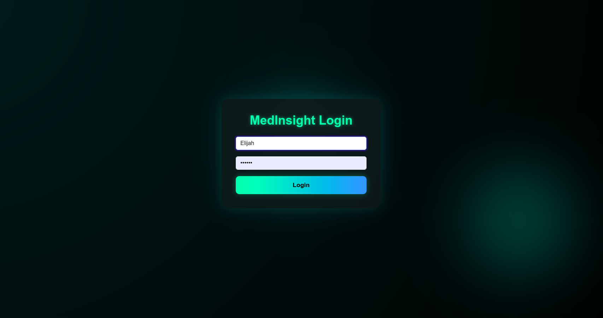
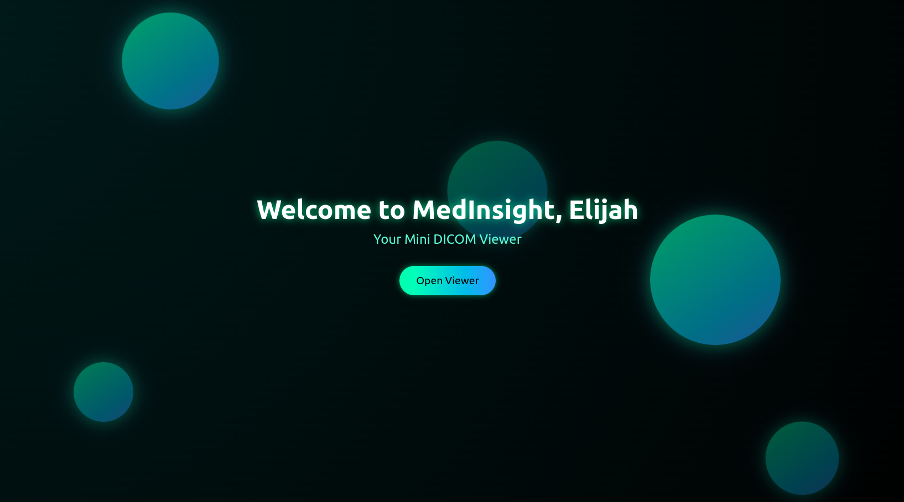
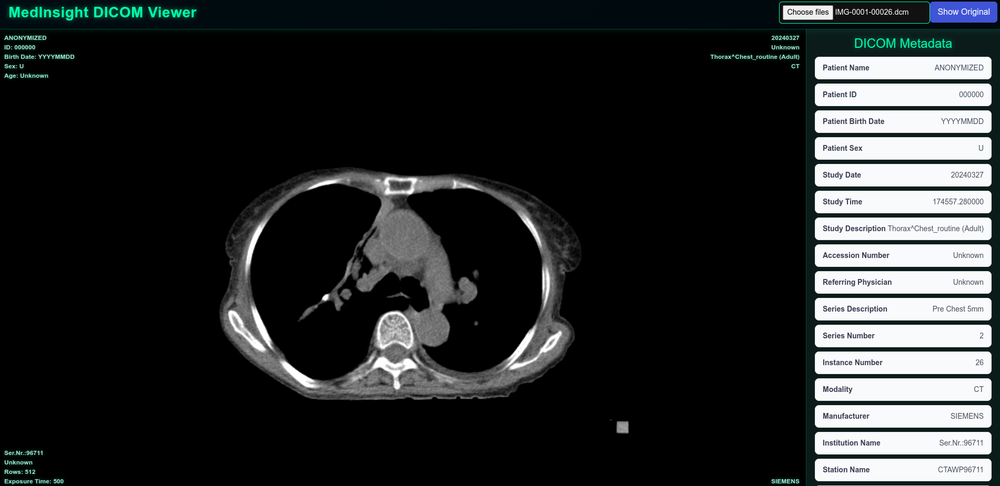

# MedInsight - DICOM Viewer

MedInsight is a lightweight web application for viewing medical DICOM images. It allows users to upload `.dcm` files, view them in a web-based viewer, and display key patient metadata extracted from the image.

---

## Features

* Upload and display DICOM (`.dcm`) images.
* View basic patient metadata:

  * Patient Name
  * Patient ID
  * Modality
  * Study Date
* Responsive and professional UI using **Bootstrap**.
* Built with **React**, **Cornerstone.js**, **dicom-parser**, and **cornerstone-wado-image-loader**.

---

## Technologies Used

* **React** – Frontend framework.
* **Bootstrap** – Styling and layout.
* **Cornerstone.js** – DICOM image rendering.
* **cornerstone-wado-image-loader** – Loads DICOM images into Cornerstone.
* **dicom-parser** – Parses DICOM metadata.

---

## Installation

1. Clone the repository:

```bash
git clone https://github.com/ElijahChileshe/MediView-A-Lightweight-Medical-Imaging-Viewer
```

2. Install dependencies:

```bash
npm install
```

3. Start the development server:

```bash
npm start
```

4. Open your browser and go to `http://localhost:3000`.

---

## Usage

1. Click the **Choose File** button to upload a `.dcm` file.
2. The DICOM image will be displayed in the viewer.
3. Patient metadata will appear below the viewer.

---


## 🖼️ Preview

### 🔐 Login Page


### 📊 Dashboard


### 🩺 DICOM Viewer



